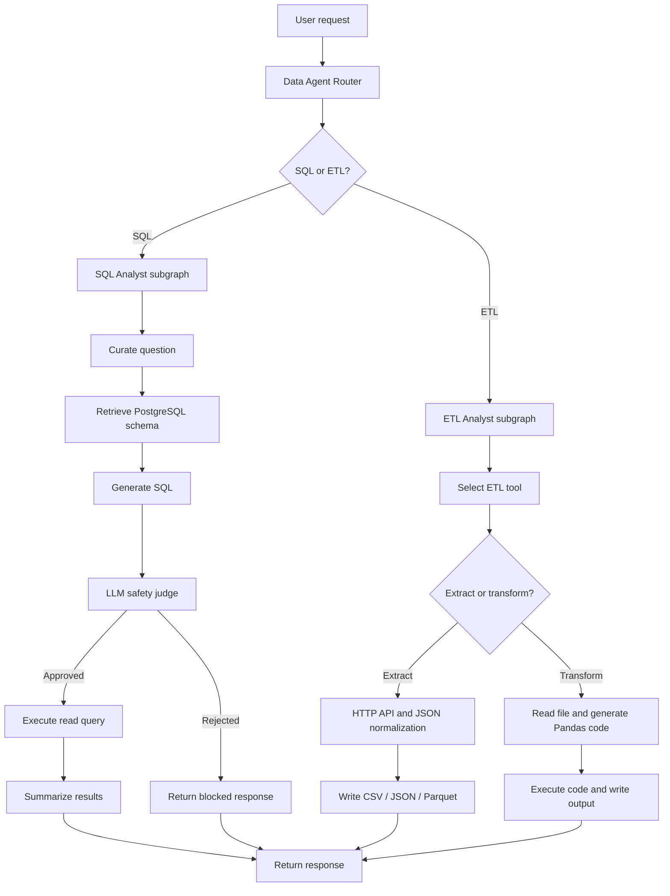
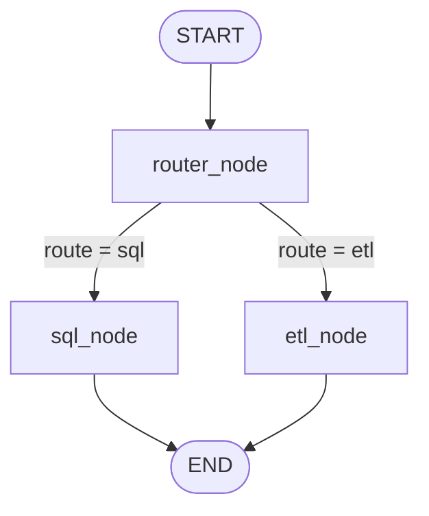
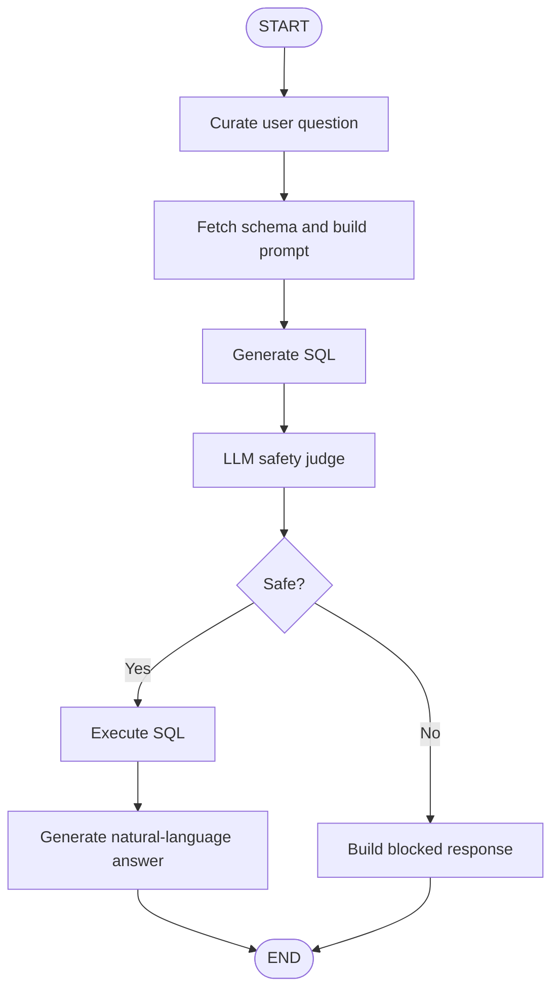
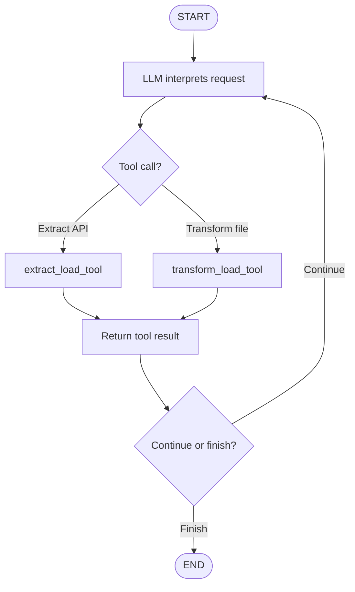

# Agentic AI Data Agent — Natural Language SQL & ETL

A Python-based, graph-orchestrated data assistant that routes natural-language requests to specialist workflows for **read-only PostgreSQL analytics** or **API/file ETL**. Built with LangGraph, LangChain, Pydantic, Pandas, and PostgreSQL.

> **Project status:** Learning/portfolio prototype. The current implementation demonstrates routing, specialist graphs, schema-aware SQL generation, an LLM-based SQL safety decision, and API/file transformations. It is **not production-hardened**: see [Security and production-readiness](#security-and-production-readiness) before running it against sensitive data.

- **Repository:** https://github.com/anujitdutta6-cmyk/AI_DATA_AGENT
- **Reference tutorial:** https://www.youtube.com/watch?v=7yOmi4IX-Rs
- **Runtime:** Python 3.12+
- **Primary database:** PostgreSQL
- **LLM configuration:** Gemini-compatible endpoint through LangChain's ChatOpenAI integration

## Contents

- [Problem statement](#problem-statement)
- [Capabilities](#capabilities)
- [Architecture](#architecture)
- [Graph walkthrough](#graph-walkthrough)
- [Specialist workflows](#specialist-workflows)
- [Repository structure](#repository-structure)
- [Technology choices](#technology-choices)
- [Setup](#setup)
- [Configuration](#configuration)
- [Run the project](#run-the-project)
- [Example scenarios](#example-scenarios)
- [Data model and sample domain](#data-model-and-sample-domain)
- [Failure handling and observability](#failure-handling-and-observability)
- [Security and production-readiness](#security-and-production-readiness)
- [Known limitations and roadmap](#known-limitations-and-roadmap)
- [Interview preparation](#interview-preparation)

---

## Problem statement

Data engineers and analysts often switch between database querying and file/API processing. This project explores a natural-language interface where a user describes the outcome they want, and an orchestrator selects a workflow.

Examples:
- “Show the five payment methods with the highest transaction volume.”
- “Extract records from this JSON API and save them as Parquet.”
- “Read a CSV, remove duplicate records, handle nulls, and save the cleaned output.”

The agent converts the request into a specialist workflow. The LLM helps interpret intent and generate a plan or code; Python, Pandas, and PostgreSQL perform the actual operations.

## Capabilities

### Implemented in the current code

- **Intent routing:** a structured-output LLM classifies a request as SQL or ETL.
- **Graph orchestration:** LangGraph StateGraphs define the main router and specialist workflows.
- **Schema-aware SQL generation:** the SQL specialist reads PostgreSQL table/column metadata and a small sample of each table.
- **SQL safety decision:** a separate LLM judge classifies generated SQL as safe or unsafe before the execution branch.
- **Natural-language result explanation:** query results are passed to an LLM to produce a user-friendly response.
- **API extraction:** requests an HTTP endpoint, normalizes a results JSON array with Pandas, and writes a supported file format.
- **File transformation:** reads CSV, line-delimited JSON, or Parquet and generates Pandas transformation code based on the request.
- **Structured state:** Pydantic models define the fields passed through the graphs.
- **Sample relational domain:** users, vehicles, rides, payments, and ratings tables are represented in the database loader and sample CSV files.

### Supported formats in the ETL workflow

| Format | Current support |
|---|---|
| CSV | Read and write |
| JSON | Read/write as line-delimited records in the current utility path |
| Parquet | Read and write; requires a compatible Parquet engine |

The extraction utility currently expects the API response to contain a top-level results field. APIs with different response shapes, pagination, authentication, or nested envelopes may need an adapter.

---

## Architecture

### High-level system architecture

The system has four logical layers:

1. **Request layer:** receives the natural-language request.
2. **Orchestration layer:** a router chooses SQL or ETL.
3. **Specialist layer:** the SQL graph or ETL graph runs the relevant steps and tools.
4. **Execution and response layer:** PostgreSQL or Pandas performs the operation, and the system returns a result.

### End-to-end flow

    User request
        |
        v
    Data Agent Router (structured LLM output)
        |
        +---- SQL ----> SQL Analyst subgraph
        |                  |
        |                  +--> Curate question
        |                  +--> Read PostgreSQL schema and sample rows
        |                  +--> Generate PostgreSQL query
        |                  +--> LLM safety judge
        |                  +--> Execute if approved / block if rejected
        |                  +--> Summarize query result
        |
        +---- ETL ----> ETL Analyst subgraph
                           |
                           +--> Interpret request and select tool
                           +--> Extract API data OR transform existing file
                           +--> Write CSV / JSON / Parquet
                           +--> Return operation status and output path

**How to read the design:** the router does not perform the business operation itself. It chooses a specialist graph. The SQL and ETL specialists have separate state and tools, which keeps their responsibilities clearer than one large prompt that attempts to do everything.

### Existing graph visualizations

These images are maintained in the repository and can be opened directly:

- **Main router graph:** [data_agent_graph.png](./data_agent_graph.png)
- **SQL specialist graph:** [sql_analyst_graph.png](./sql_analyst_graph.png)
- **ETL specialist graph:** [etl_analyst_graph.png](./etl_analyst_graph.png)

### Main router graph

The router's structured output is normalized and checked against the supported route values. A conditional edge dispatches the request to one specialist, and the specialist result is returned as a message.

---

## Graph walkthrough

LangGraph represents a workflow with **state, nodes, and edges**:

- **State:** the data carried between steps, defined here with Pydantic models.
- **Node:** a Python function that reads state and returns or updates state.
- **Edge:** a connection that determines which node executes next.
- **Conditional edge:** a routing function chooses the next node based on state.
- **START / END:** graph entry and exit points.

### 1. SQL Analyst graph

The intended safety branch is useful, but the current judge is an LLM decision—not a deterministic SQL parser or a database-enforced security boundary. See the security section for what should change before production use.

### 2. ETL Analyst graph

The ETL graph uses an LLM to interpret the task and select a tool. The tools currently cover extraction and transformation.

The exact execution path depends on the model's tool-call output. Tool errors are generally returned as text, so callers should verify the final output file and status rather than assuming a tool call succeeded.

---

## Specialist workflows

### A. Data Agent — router and orchestrator

**File:** Agents/data_agent.py

Responsibilities:

1. Reads the latest user message.
2. Calls a structured-output LLM to classify the request.
3. Validates the route against SQL and ETL.
4. Invokes the corresponding specialist graph.
5. Extracts the specialist's final answer and returns it.

**Why use a router?** SQL analytics and ETL have different tools, validation rules, and failure modes. A router makes the control flow explicit and makes it easier to add another specialist later, such as a data-quality or metadata agent.

### B. SQL Analyst — natural language to PostgreSQL

**Files:** Agents/sql_analyst.py, utils/database.py

Current sequence:

1. **Question curation:** rewrites the request for clarity.
2. **Schema discovery:** reads table names, columns, data types, and up to five sample rows from the public schema.
3. **SQL generation:** asks the LLM for PostgreSQL SQL and instructs it to generate read-only queries.
4. **Safety judgment:** asks a structured-output LLM judge to approve or reject the query.
5. **Execution:** sends approved SQL to PostgreSQL through DatabaseUtil.
6. **Answer synthesis:** explains the returned records in plain language.

This design is schema-aware: the model is given database metadata rather than being asked to invent table and column names. However, the current implementation loads metadata for the whole public schema, which can become expensive and expose more schema/sample data than a specific request needs.

### C. ETL Analyst — API extraction and file transformation

**Files:** Agents/etl_analyst.py, utils/etl_tools.py

**Extraction path**

1. The agent identifies the API URL, destination folder, and output format.
2. The extraction tool issues an HTTP GET request.
3. The utility parses JSON and currently reads data['results'].
4. Pandas normalizes the records and writes the selected output format.
5. The tool returns the output path and a status message.

**Transformation path**

1. The agent identifies the source file, requested changes, output folder, and output format.
2. The utility reads the source dataset and provides a small sample to the LLM.
3. The LLM generates Pandas code.
4. The current utility executes that code and reports a status.
5. The agent searches for an output file and returns the result.

**Important distinction:** the current ETL path executes generated Python with exec(). That is arbitrary code execution, not a sandbox. It must be replaced or isolated before untrusted users can submit requests.

---

## Repository structure

    AI_DATA_AGENT/
    ├── Agents/
    │   ├── data_agent.py          # Main router graph
    │   ├── sql_analyst.py         # SQL specialist graph
    │   └── etl_analyst.py         # ETL specialist graph
    ├── Models/
    │   └── schema.py              # Pydantic state and output schemas
    ├── utils/
    │   ├── database.py            # PostgreSQL connection, schema, execution
    │   ├── etl_tools.py            # API extraction and Pandas utilities
    │   ├── feed_db.py              # Creates sample tables and loads CSV files
    │   └── llm_pick.py             # LLM configuration and selection
    ├── data/
    │   ├── users.csv
    │   ├── vehicles.csv
    │   ├── rides.csv
    │   ├── payments.csv
    │   ├── ratings.csv
    │   └── extract/                 # ETL output location
    ├── Test/
    │   └── stratch.py              # Scratch experiment; not a full test suite
    ├── data_agent_graph.png
    ├── sql_analyst_graph.png
    ├── etl_analyst_graph.png
    ├── main.py                     # Example entry point
    ├── test_schema_details.txt     # Sample schema context
    ├── pyproject.toml               # Python dependencies
    └── uv.lock                      # Locked dependency resolution

---

## Technology choices

| Technology | Role in this project |
|---|---|
| Python 3.12+ | Application language and ETL logic |
| LangGraph | Stateful graph orchestration and conditional routing |
| LangChain | Chat-model integration and tool abstractions |
| Pydantic | Typed/structured state and model outputs |
| Gemini-compatible API | LLM calls through ChatOpenAI with a configured base URL |
| PostgreSQL | Relational source for read-only natural-language analytics |
| psycopg2 | PostgreSQL connectivity |
| Pandas | JSON normalization and tabular file transformations |
| Requests | HTTP API extraction |
| python-dotenv | Local environment configuration |
| uv | Dependency management using pyproject.toml and uv.lock |

---

## Setup

### Prerequisites

- Python 3.12 or later
- PostgreSQL available locally or remotely for SQL questions
- A Gemini-compatible API endpoint and key
- Git
- uv recommended for dependency installation

### 1. Clone and install

    git clone https://github.com/anujitdutta6-cmyk/AI_DATA_AGENT.git
    cd AI_DATA_AGENT
    # Install uv if needed: python -m pip install uv
    uv sync

If you prefer a standard virtual environment, create and activate one first, then install the dependencies declared in pyproject.toml.

### 2. Configure environment variables

Create a local .env file in the project root. Do not commit real credentials.

    # Gemini-compatible endpoint, consumed by utils/llm_pick.py
    Gemini_Api_Key=replace_with_your_api_key
    GEMINI_URL=https://your-provider-compatible-endpoint/v1
    GEMINI_MEDIUM_MODEL=your_model_for_low_or_high_setting
    GEMINI_HIGH_MODEL=your_model_for_medium_setting

    # PostgreSQL connection, used by SQL Analyst and feed_db.py
    host=localhost
    port=5432
    user=your_read_only_database_user
    password=replace_with_your_database_password
    database=your_database_name

The configured model names must be valid for your provider's OpenAI-compatible endpoint. The current pick_llm() maps low and high to GEMINI_MEDIUM_MODEL, and medium to GEMINI_HIGH_MODEL; consider renaming these settings so the names match the actual mapping.

### 3. Prepare the PostgreSQL sample database

Review utils/feed_db.py before running it. It creates the sample tables and loads the CSV files into PostgreSQL. Run it only against a dedicated development database; it opens a database connection and performs table/data-loading operations.

    uv run python utils/feed_db.py

The SQL agent expects the configured database to contain a public schema with accessible tables.

---

## Configuration

### LLM selection

The pick_llm(level) helper reads the API key, endpoint, and model names from environment variables and creates a ChatOpenAI client configured for that endpoint.

- **low:** intended for simpler tasks such as question curation and answer formatting.
- **medium:** used for SQL generation, safety judgment, and ETL transformation planning.
- **high:** currently maps to the same model environment variable as low, so it is **not a distinct higher-capability tier** in the current implementation.

Treat these labels as configuration aliases, not as an automatic model router based on measured task complexity.

### Database access

The SQL agent currently reads schema information from public and executes generated queries using the configured PostgreSQL credentials. For safer operation, configure a dedicated database role with only the minimum required privileges. Application prompts are not a substitute for database permissions.

---

## Run the project

### Run the sample entry point

    uv run python main.py

The current main.py example asks the ETL agent to extract Pokémon API data to the data/extract directory as CSV. It prints the graph response.

### Ask your own question

Use the same invocation pattern in a Python script:

    from langchain_core.messages import HumanMessage
    from Agents.data_agent import data_agent

    result = data_agent.invoke({
        "messages": [
            HumanMessage(
                content="Show the top 5 payment methods by number of transactions."
            )
        ],
        "route_response": "",
    })

    print(result["messages"][-1].content)

### Example API extraction request

    result = data_agent.invoke({
        "messages": [
            HumanMessage(
                content=(
                    "Extract https://pokeapi.co/api/v2/pokemon "
                    "and save the results under data/extract as CSV."
                )
            )
        ],
        "route_response": "",
    })

    print(result["messages"][-1].content)

The example endpoint returns a results array, matching the current extraction utility's expected response shape. For other APIs, check the response structure before using the same implementation.

---

## Example scenarios

### Scenario 1 — Operations analytics

**Request:** “What are the top five payment methods by transaction count?”

1. Router classifies the request as SQL.
2. SQL Analyst retrieves database metadata and sample rows.
3. LLM generates a PostgreSQL aggregation query.
4. Safety judge evaluates the generated query.
5. Approved query executes; the answer model summarizes the result.

**Business value:** analysts can explore relational data without manually writing every query.

### Scenario 2 — API ingestion

**Request:** “Extract the Pokémon API results and save them as Parquet.”

1. Router chooses ETL.
2. ETL agent selects the extraction tool.
3. HTTP response is parsed and the results array is normalized.
4. Pandas writes Parquet to the requested directory.
5. The agent returns a status and output path.

**Production extension:** add pagination, timeouts, retries with backoff, API authentication, rate-limit handling, schema validation, and incremental checkpoints.

### Scenario 3 — Data cleaning

**Request:** “Read a rides CSV, remove duplicate rows, handle missing values, and save the cleaned dataset as Parquet.”

The ETL agent can use the file sample and request to generate Pandas transformation code. In a production implementation, the generated plan should be converted into an allow-listed set of deterministic operations, validated, and run in an isolated worker—not executed directly in the main process.

### Scenario 4 — SQL generation fails

**Problem:** the generated query references a column that does not exist or is incompatible with PostgreSQL.

**Recommended production flow:** validate identifiers against retrieved metadata, run a read-only EXPLAIN or equivalent preflight under restricted credentials, capture a sanitized error, and allow a bounded retry. The current code does not provide a fully implemented, bounded query-repair loop.

### Scenario 5 — Ambiguous user request

**Request:** “Show me the latest records and export them.”

This could mean querying PostgreSQL, exporting a query result, or transforming an existing file. A production router should ask a clarifying question when confidence is low instead of forcing every request into one of two routes.

---

## Data model and sample domain

The sample dataset models a ride-sharing style application:

- **users:** rider/driver identity and profile attributes
- **vehicles:** vehicle information associated with a driver
- **rides:** rider, driver, timestamps, distance, fare, status, and locations
- **payments:** ride payments, amounts, methods, and statuses
- **ratings:** ride ratings and feedback

The loader in utils/feed_db.py defines primary keys, foreign keys, a rating check constraint, and indexes for several common joins and filters. The actual schema available to the agent is discovered dynamically from PostgreSQL metadata.

Example analytical questions:

- Which payment methods have the most completed transactions?
- What is the average fare by ride status?
- Which drivers have the highest average rating?
- How many rides were cancelled by day?
- Which cities have the highest active-user counts?

Use the actual table/column definitions as the source of truth when composing queries; examples may need to be adjusted to the loaded schema.

---

## Failure handling and observability

### Current behavior

- Router output is normalized and checked against supported route values.
- SQL/ETL nodes catch some specialist exceptions and return error text.
- The database utility catches connection/query exceptions and returns error messages.
- ETL tools return success/failure strings.
- Graph PNGs can be generated from the compiled LangGraph definitions.

### Recommended production controls

- Structured application logs with request ID, selected route, node name, duration, and sanitized error category.
- LangSmith tracing with sensitive prompts, row values, credentials, and personal data redacted.
- Explicit timeout and retry policies for model calls, HTTP requests, and database operations.
- Typed tool outputs with status, error_code, output_path, and row counts instead of relying on free-form strings.
- A bounded retry count and a terminal failure state.
- Unit tests for routing, SQL policy, API response shapes, transformation logic, and graph branches.
- Evaluation datasets for routing accuracy, SQL execution accuracy, ETL correctness, latency, and cost.

---

## Security and production-readiness

This project is a prototype. The following are important hardening tasks, not claims of existing protection.

### 1. Do not rely on an LLM as the only SQL security gate

The SQL safety judge is another model call and may misclassify a query. Before execution, add deterministic SQL parsing/allow-list validation, reject multiple statements and non-read-only constructs, and enforce read-only database permissions. Use statement timeouts and row/result limits as defense in depth.

### 2. Replace unrestricted Python exec()

utils/etl_tools.py currently executes model-generated Python using exec(code) in the application process. Prompt instructions such as “do not call external APIs” do not enforce that restriction. Never expose this to untrusted requests or production data.

Safer design:
- Prefer an allow-listed transformation DSL mapped to known Pandas operations.
- If arbitrary code is essential, run it in a short-lived isolated container with no secrets, restricted filesystem, resource limits, and disabled network access.
- Validate output location, file type, size, and schema.
- Treat input files and their contents as untrusted.

### 3. Protect secrets and sensitive records

- Keep .env out of Git and rotate any credential that has been committed.
- Use a least-privilege database account and separate development/production credentials.
- Avoid sending complete sample rows, PII, or sensitive values to the LLM; use minimal schema context and masked examples.
- Restrict API destinations to prevent server-side request forgery (SSRF), including loopback, private-network, and cloud metadata endpoints.
- Validate paths to prevent path traversal and writing outside approved directories.

### 4. Make operations bounded and auditable

Add HTTP timeouts, pagination limits, retry/backoff, maximum input size, maximum execution time, audit records, approval gates for high-impact actions, and deterministic validation before writing outputs.

---

## Known limitations and roadmap

The items below are based on reviewing the current repository contents; they are useful next steps for making the project more robust.

- [ ] Replace LLM-only SQL safety decisions with deterministic validation and read-only DB enforcement.
- [ ] Remove unrestricted exec(); use a transformation DSL or isolated worker.
- [ ] Add API timeouts, pagination, retry/backoff, response-schema validation, and SSRF protection.
- [ ] Fix ETL execution scope: generated transformation code expects input_file_path, output_folder, and output_format, but the current execute_code() call uses exec(code) without explicitly passing those variables into the execution namespace.
- [ ] Declare direct dependencies used by the code, including requests and a Parquet engine such as pyarrow, rather than relying on transitive packages or optional local installs.
- [ ] Add file-size limits, path allow-lists, and atomic output writes.
- [ ] Narrow schema retrieval to relevant tables and mask sample values.
- [ ] Add bounded SQL retry/repair with explicit stop conditions.
- [ ] Ask clarifying questions for ambiguous or unsupported requests.
- [ ] Add unit/integration tests and an evaluation set for routing, SQL, and ETL quality.
- [ ] Add structured logs, tracing, metrics, and cost/latency tracking.
- [ ] Add checkpointed conversation state and human approval for sensitive operations.
- [ ] Add CI checks, linting, formatting, dependency/security scanning, and a clean test directory.
- [ ] Remove tracked __pycache__ artifacts and add ignore rules for bytecode, local environments, logs, and secrets.
- [ ] Review the packaging entry point in pyproject.toml: it points to ai_data_agent:main, while the current source package does not define that entry point.
- [ ] Consider moving the application into one consistent installable package rather than mixing top-level Agents, Models, and utils directories with an otherwise empty src/ai_data_agent package.

---

## Interview preparation

### 30-second project explanation

> “I built a graph-based AI Data Agent using Python, LangChain, and LangGraph. A router classifies natural-language requests into SQL analytics or ETL operations and dispatches them to specialist subgraphs. The SQL workflow retrieves PostgreSQL schema context, generates a query, applies a safety check, executes approved reads, and summarizes the result. The ETL workflow extracts API data or transforms CSV, JSON, and Parquet files with Pandas. The project demonstrates multi-agent orchestration and tool integration, and I have identified additional controls required for production-grade security and reliability.”

### Explain the architecture clearly

**Why LangGraph?** It makes workflow state, nodes, and conditional routing explicit. This is easier to inspect and extend than burying the entire process inside one long prompt.

**Why separate SQL and ETL specialists?** Their tools and risks differ. SQL requires strict database access controls; ETL requires file, API, schema, and code-execution controls.

**Why provide schema context to the SQL LLM?** It reduces invented table and column names and grounds query generation in the actual database. It does not guarantee correctness.

**Why structured output?** Pydantic schemas constrain expected fields and route values. Structured output improves parsing reliability, but does not prove that a decision is correct or safe.

**What is the biggest security concern?** The current ETL agent executes LLM-generated Python with unrestricted exec(), and SQL safety relies on an LLM judge. A production design must use deterministic validation, least-privilege permissions, and an isolated execution boundary.

**How would you scale it?** Expose a stateless API layer, persist graph checkpoints per conversation, use a queue and isolated ETL workers for long-running tasks, add connection pooling and concurrency limits, and instrument each node with traces and metrics.

**How would you improve accuracy?** Evaluate a representative benchmark, measure routing and SQL execution accuracy, validate tool inputs and outputs, limit retries, and keep generated plans separate from deterministic execution.

### Real-world engineering trade-offs

| Design choice | Benefit | Trade-off / control |
|---|---|---|
| LLM-based router | Flexible natural-language understanding | Misrouting; confidence thresholds and clarification |
| Schema-aware SQL generation | Better grounding in real tables | Metadata overhead and sensitive sample exposure |
| Separate safety judge | Independent review step | Extra latency/cost and possible false decisions |
| LLM-generated ETL code | Flexible transformations | High execution risk; replace with DSL or isolate |
| Pandas processing | Simple for moderate datasets | Memory-bound; use Spark or distributed processing for larger data |
| Graph-based workflow | Visible branching and extensibility | More components to test and observe |

### Be accurate in interviews

Describe the project as a **working prototype with explicit hardening opportunities**, not as a fully sandboxed or production-secure agent. Clearly separate implemented functionality from the roadmap above.

---

## References

- [Project repository](https://github.com/anujitdutta6-cmyk/AI_DATA_AGENT)
- [YouTube tutorial referenced for this project](https://www.youtube.com/watch?v=7yOmi4IX-Rs)
- [LangGraph documentation](https://docs.langchain.com/oss/python/langgraph/overview)
- [LangChain SQL agent guide](https://docs.langchain.com/oss/python/langchain/sql-agent)

## License

No license file was present in the repository at the time this README was prepared. Add a license before presenting the project as open source for reuse.
